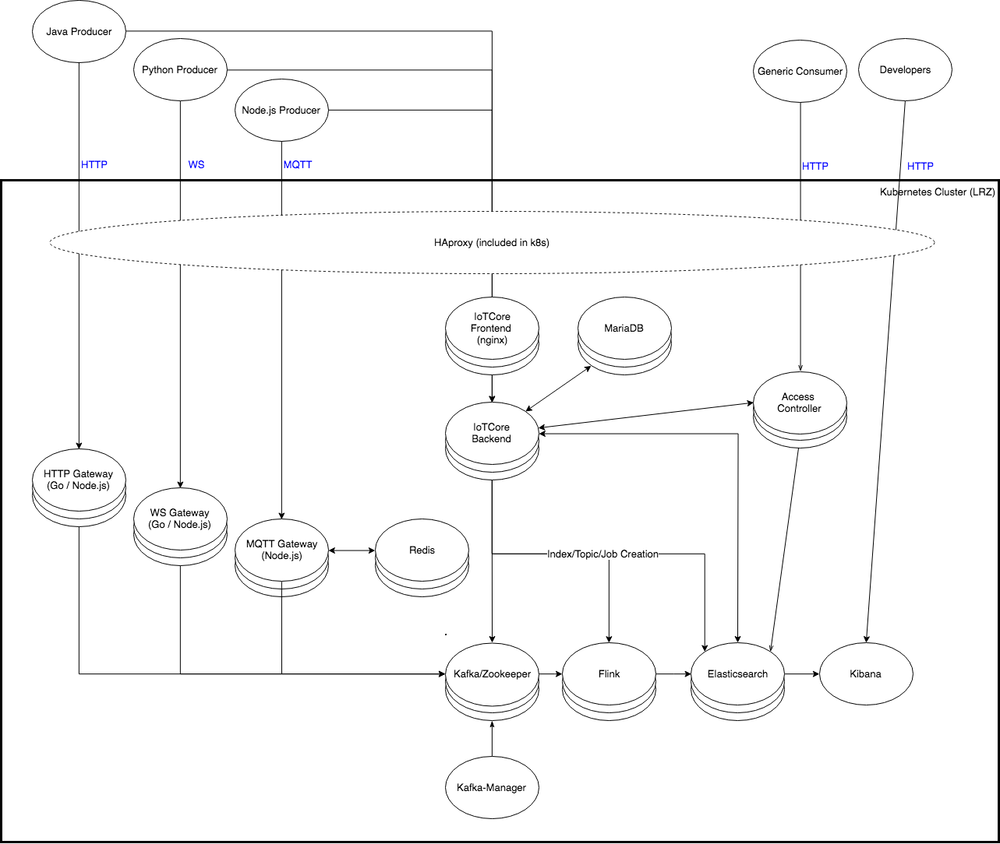

# iotplatform

## Architecture
### Overview

### Components (Plan!)
#### IoTCore
- Metadata administration (CRUD-operations for devicemanagement)
- Create topics/indices/jobs within cluster components
- Check authorization of incoming requests
- Provide metadata information to gateways upon request, according to predefined schema

#### MQTT/HTTP/WS Gateway
- Cloud gateways enabling data ingestion
- Different protocols are supported by different gateways (depending on load, respective gateways can be scaled)
- Gateways enrich incoming sensordata with respective device information
- Data is forwarded to Kafka, topic is received from IoTCore

#### AccessController
- API that acts as buffer between consumer and Elasticsearch
- Check with IoTCore whether user is authorized to receive requested information

#### Kafka/Zookeeper
- Big data stream (collecting data from all gateways, no matter the protocol)
- Act as single point of information for processing layer

#### Flink
- Offer possibilities to add batch processing or analytical jobs
- Consume Kafka topics provided by IoTCore and forward data to Elasticsearch

#### Elasticsearch
- Peristence

#### Grafana
- Monitoring opportunity for Elasticsearch (Dev Ops)

#### Java/Node.js/Python Producer
- Sample producers to simulate the supported protocols
- Constructed scalable to simulate high loads on cluster

#### GenericConsumer
- Sample consumer that accesses various APIs
